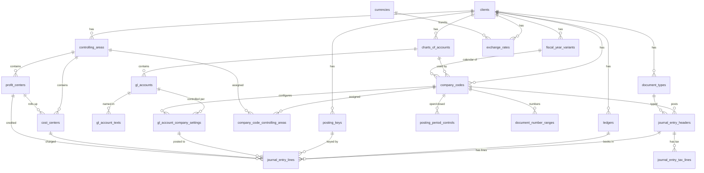

# Finance & Accounting Digital Twin: S/4HANA-Style Model

A complete record of the design discussion, schema, business rules, synthetic data and deliverables for the finance digital twin.

---

## 1. Goal and approach

**Goal:** build a *digital twin* of a finance and accounting backend, a safe simulation environment (like a mechanical simulation) where AI agents can be built and tested against realistic data without touching a real ERP.

**Process:**
1. Clone the backend structure (tables, keys, relationships), modelled on SAP S/4HANA Finance.
2. Produce the ER diagram from the relationships.
3. Create tools the agent can call (post an entry, get a balance, list open items, and so on).
4. Fill the database with interconnected synthetic data, including deliberately messy cases.

**Design decisions made during the discussion:**

| Decision | Choice |
|---|---|
| Modelling style | The S/4HANA way (Universal Journal), not the old ECC way |
| Naming | **General, readable names** (`company_code`, `journal_entry_lines`), not SAP abbreviations (`BUKRS`, `ACDOCA`) |
| Portability | A `schema_name_mapping` table plus `sap_compat` alias views keep the link to SAP names |
| Database | PostgreSQL 13+ |
| Scope | Phase 1 only: org structure, G/L master, journal entries, posting controls, trial balance |

---

## 2. The big S/4HANA change: the Universal Journal

In old ECC, finance data was scattered: `BKPF/BSEG` (documents), `BSIS/BSAS/BSID/BSAD/BSIK/BSAK` (open/cleared item indexes), `GLT0` (period totals), `COEP` (controlling), `FAGLFLEXA` (new G/L), `ANEP` (assets), `MLIT` (material ledger). The redundancy existed for performance on row-store databases, and FI and CO could drift out of sync.

In S/4HANA the database is columnar and in-memory, so wide tables are cheap and aggregation on the fly is fast. SAP therefore merged everything into one line-item table, **ACDOCA** (the Universal Journal). The old tables survive as compatibility views.

**Model the S/4 way: header + one wide line-item table + views.**

---

## 3. Why the schema looks the way it does: five design ideas

1. **Multi-tenancy.** Every table starts with the client column. One installation hosts many isolated clients. For the twin, this means several independent synthetic companies in one database.
2. **Separate "define once" from "control locally".** Master data is layered: chart-of-accounts level, company-code level, language level.
3. **Header/item split.** Common data is stored once (header). Details are stored per line (items). The balancing rule applies per document.
4. **Behaviour lives in configuration tables.** Document types, posting keys, period controls and number ranges are plain data, so rules change without code.
5. **Everything is one posting.** One business event is stored once, in one wide table.

### 3.1 Organizational hierarchy

```
Client
 ├── Chart of Accounts            shared account list
 ├── Controlling Area             management accounting scope
 └── Company Code                 legal entity: own books, own currency, own fiscal calendar
       └── Profit Center / Cost Center
```

Two views of the business:
- **Legal view (company code):** the smallest unit that produces a balance sheet and P&L.
- **Management view (controlling area, cost/profit centers):** how the business is steered internally.

Every posting line carries both, so one line serves both reporting worlds.

### 3.2 Layered master data

| Layer | Holds | Why |
|---|---|---|
| Chart-of-accounts level | Account number, group, balance sheet vs P&L | One consistent group-wide account list (consolidation works) |
| Company-code level | Currency, open-item management, blocked flag, reconciliation-account flag | Each legal entity can behave differently |
| Language level | Names and descriptions | One name per language, no duplicated rows |

The same three-level pattern applies to vendors and customers. In S/4HANA the **Business Partner** is the lead object; one real-world party can hold several roles (customer, supplier).

### 3.3 Header and item

- **Header** (key: client, company code, fiscal year, document number): what is true for the whole document: type, dates, currency, reference, creator, reversal links.
- **Line items** (key adds ledger and line number): what differs per line: account, amounts, cost/profit center, partner, tax code, clearing status.
- The document number alone is **not unique**, because number ranges reset per company code and fiscal year. That is why every lookup needs company code + fiscal year + document number.

### 3.4 Design details inside the Universal Journal

- **Ledger column:** parallel accounting (the same event under IFRS in ledger `2L` and US GAAP in `0L`) is rows distinguished by ledger, not separate tables.
- **Currencies as columns:** transaction, company-code and group currency amounts are all stored at posting time, so history never changes when rates move.
- **Account type column:** one table holds G/L, vendor, customer and asset lines.
- **Clearing fields:** open vs cleared is a property of the line. "Open items" is just a filter.
- **Sign convention:** debit positive, credit negative, with a debit/credit indicator repeated for readability.

### 3.5 Sub-ledgers and reconciliation accounts

A vendor invoice posts a vendor line plus an expense line. The vendor line lands on a **reconciliation account** (for example Trade payables). That G/L account is flagged so nobody can post to it directly. This guarantees the sub-ledger always equals the G/L balance. In the twin it is enforced by a trigger, and it is a classic agent trap.

### 3.6 Why SAP names look cryptic

The technical names are abbreviated German, from SAP's origins: `BUKRS` (Buchungskreis, company code), `BELNR` (Belegnummer, document number), `GJAHR` (Geschäftsjahr, fiscal year), `KUNNR` (Kunde, customer), `LIFNR` (Lieferant, vendor), `KOSTL` (Kostenstelle, cost center), `BUDAT` (Buchungsdatum, posting date), `WAERS` (Währung, currency).

Other SAP quirks: zero-padded character keys (`'0000100045'`), dates as `YYYYMMDD` strings, amounts paired with a currency key, and field-name drift (`BUKRS` in the header vs `RBUKRS` in `ACDOCA`).

---

## 4. Naming: friendly names with SAP traceability

**Conventions used:** snake_case, plural nouns for tables, one name per concept everywhere (no `BUKRS`/`RBUKRS` drift), real types (`DATE`, `NUMERIC(23,2)`, `BOOLEAN`).

**Kept deliberately:** zero-padded text for `document_number` and account/partner IDs, to preserve a join pitfall the agent should learn.

**Trade-off:** an agent trained on friendly names won't transfer directly to a real S/4HANA system. The mapping layer solves this.

### 4.1 Table mapping

| SAP | General name |
|---|---|
| T000 | `clients` |
| T001 | `company_codes` |
| T004 | `charts_of_accounts` |
| TKA01 | `controlling_areas` |
| SKA1 | `gl_accounts` |
| SKB1 | `gl_account_company_settings` |
| SKAT | `gl_account_texts` |
| BUT000 | `business_partners` (Phase 2) |
| LFA1 / LFB1 | `vendors` / `vendor_company_settings` (Phase 2) |
| KNA1 / KNB1 | `customers` / `customer_company_settings` (Phase 2) |
| CSKS | `cost_centers` |
| CEPC | `profit_centers` |
| AUFK | `internal_orders` (later phase) |
| BKPF | `journal_entry_headers` |
| ACDOCA | `journal_entry_lines` |
| BSET | `journal_entry_tax_lines` |
| T003 | `document_types` |
| TBSL | `posting_keys` |
| T009 | `fiscal_year_variants` |
| T001B | `posting_period_controls` |
| NRIV | `document_number_ranges` |
| T007A | `tax_codes` (Phase 3) |
| T052 | `payment_terms` (Phase 2) |
| TCURR | `exchange_rates` |
| TCURC | `currencies` |
| FINSC_LEDGER | `ledgers` |

### 4.2 Column mapping, headers (BKPF)

| SAP | General name |
|---|---|
| MANDT | `client_id` |
| BUKRS | `company_code` |
| BELNR | `document_number` |
| GJAHR | `fiscal_year` |
| BLART | `document_type` |
| BLDAT | `document_date` |
| BUDAT | `posting_date` |
| MONAT | `posting_period` |
| WAERS | `currency` |
| XBLNR | `external_reference` |
| BKTXT | `header_text` |
| USNAM | `created_by` |
| STBLG | `reversed_by_document` |

### 4.3 Column mapping, lines (ACDOCA)

| SAP | General name |
|---|---|
| RLDNR | `ledger` |
| DOCLN | `line_number` |
| RACCT | `gl_account` |
| KOART | `account_type` |
| DRCRK | `debit_credit_indicator` |
| WSL | `amount_transaction_currency` |
| RTCUR | `transaction_currency` |
| HSL | `amount_company_currency` |
| KSL | `amount_group_currency` |
| RCNTR | `cost_center` |
| PRCTR | `profit_center` |
| LIFNR | `vendor_id` |
| KUNNR | `customer_id` |
| MWSKZ | `tax_code` |
| AUGDT / AUGBL | `clearing_date` / `clearing_document` |
| XOPVW | `is_open_item` |
| SGTXT | `line_text` |

### 4.4 Three portability options

1. **`schema_name_mapping` table**, pre-filled, stores friendly ↔ SAP names as data.
2. **`sap_compat` schema**, with alias views `bkpf` and `acdoca` that expose the friendly tables under SAP column names.
3. **Tool descriptions** for the agent can mention both names ("gl_account, SAP: RACCT").

---

## 5. Getting the real S/4HANA schema (for higher fidelity)

1. **With an SAP system or test client:** export the data dictionary: `DD02L` (tables), `DD03L` (fields, keys, types), `DD04L`/`DD01L` (data elements/domains), and `DD08L` (foreign-key relationships, which is essentially the ER diagram). Script DDL generation from these.
2. **Without a system:** use the SAP Business Accelerator Hub (released CDS/OData views such as `I_JournalEntry`, `I_OperationalAcctgDocItem`), SAP Help Portal, and the S/4HANA Simplification List.
3. **SAP Model Company / Fiori trial** can supply sample data to mimic.

---

## 6. Phasing

| Phase | Scope | Status |
|---|---|---|
| **1** | Org structure, G/L master, journal entries, posting controls, trial balance | **Done** (DDL + seed data) |
| 2 | Business partners, vendors, customers, open items, clearing, payments, payment terms | Planned |
| 3 | Controlling detail, tax codes, FX revaluation, period close, balance carry-forward | Planned |
| 4 | Upstream P2P / O2C documents, assets, material ledger | Planned |

---

## 7. Phase 1 schema: all tables and their purpose

### Foundation

| Table | Purpose |
|---|---|
| `clients` | Top-level tenant. Each client is an isolated synthetic company group, so several scenarios can share one database. |
| `currencies` | Valid currencies and decimal places (JPY 0, USD 2). Not tied to a client. |
| `exchange_rates` | Conversion rates by date, used to compute company- and group-currency amounts. |

### Organization structure

| Table | Purpose |
|---|---|
| `charts_of_accounts` | Named list of G/L accounts shared by several companies. |
| `fiscal_year_variants` | Fiscal calendar: periods per year, calendar-year flag. |
| `ledgers` | Parallel accounting books (US GAAP, IFRS). Exactly one leading ledger per client. |
| `company_codes` | The legal entity: own balance sheet, currency, chart of accounts, fiscal calendar. |
| `controlling_areas` | Scope for internal cost and profit reporting. |
| `company_code_controlling_areas` | Assigns each company code to a controlling area. |

### G/L account master (three layers)

| Table | Purpose |
|---|---|
| `gl_accounts` | The account itself: number, group, balance sheet vs P&L, blocked flag. |
| `gl_account_texts` | Names per language. |
| `gl_account_company_settings` | Per-company control: allowed currency, open-item management, blocked flag, reconciliation-account type. |

### Management accounting

| Table | Purpose |
|---|---|
| `cost_centers` | Units where costs are collected (Administration, Sales, ...). |
| `profit_centers` | Units whose profit is measured (product line, division). |

### Posting configuration (rules as data)

| Table | Purpose |
|---|---|
| `document_types` | Document categories (G/L entry, vendor invoice, ...). Decide number range and allowed account types. |
| `posting_keys` | Debit or credit, and which account type a line hits. |
| `posting_period_controls` | Which periods are open or closed per company and year. |
| `document_number_ranges` | Hands out the next document number per company, range and year. |

### Transactions

| Table | Purpose |
|---|---|
| `journal_entry_headers` | One row per accounting document: type, dates, currency, reference, creator, reversal links. |
| `journal_entry_lines` | The universal journal. One row per debit or credit; every report is built on it. |
| `journal_entry_tax_lines` | Tax details per document (base, tax amount, rate). |

### Support

| Table | Purpose |
|---|---|
| `schema_name_mapping` | Friendly ↔ SAP name translation. |

### Views and functions

| Name | Type | Purpose |
|---|---|---|
| `gl_account_period_balances` | View | Per-account, per-period totals (replaces `GLT0`/`FAGLFLEXT`) |
| `trial_balance()` | Function | Balance of every account up to a chosen period |
| `journal_entries_flat` | View | Headers joined to lines, for agent tools |
| `next_document_number()` | Function | Next number from the range |
| `sap_compat.bkpf`, `sap_compat.acdoca` | Views | Friendly tables under SAP column names |

---

## 8. Relationships and entry point

**Entry point table: `clients`.**

**Eight tables connect directly to `clients`:**

1. `exchange_rates`: currency conversion rates for that client
2. `charts_of_accounts`: the account list companies share
3. `fiscal_year_variants`: the fiscal calendar
4. `ledgers`: parallel accounting books
5. `company_codes`: the legal entities
6. `controlling_areas`: cost/profit reporting scope
7. `document_types`: posting rules per document kind
8. `posting_keys`: debit/credit rules per account type

Other tables reach `clients` indirectly: `client_id` is the first column of their keys, and they link through the tables above. `currencies` and `schema_name_mapping` are not client-scoped.

### 8.1 Relationship overview



### 8.2 Lookup path from a posting line

```
journal_entry_headers 1───* journal_entry_lines
                               │ gl_account    → gl_account_company_settings → gl_accounts
                               │ cost_center   → cost_centers
                               │ profit_center → profit_centers
                               │ ledger        → ledgers
                               │ posting_key   → posting_keys
                               └ vendor_id / customer_id → (Phase 2 partner tables)
journal_entry_headers.document_type → document_types
journal_entry_headers.company_code  → company_codes → charts_of_accounts
```

### 8.3 How the tables work together when posting

1. `document_types` and `document_number_ranges` give the type and number.
2. `posting_period_controls` confirms the period is open.
3. `journal_entry_headers` stores the document.
4. `journal_entry_lines` stores each debit and credit, validated against `gl_account_company_settings`, `cost_centers` and `profit_centers`.
5. Reports such as `trial_balance()` read the lines.

---

## 9. Business rules enforced in the database

SAP-style validations are implemented as triggers, so an agent meets the same kind of failures it would in production.

| Rule | Error the agent sees |
|---|---|
| Document balances in company currency **and** in each transaction currency (checked at COMMIT) | "Document … is not balanced" |
| Posting period must be open for the company | "Posting period … is not open" |
| Posting date must fall in the document's fiscal year | "Posting date … does not belong to fiscal year …" |
| Direct posting to a reconciliation account is rejected unless `is_system_generated` | "Account … is a reconciliation account" |
| Blocked accounts reject postings | "G/L account … is blocked" |
| Accounts restricted to one currency reject others | "Account … only allows postings in currency …" |
| Open-item flag only on open-item-managed accounts | "Account … is not open-item managed" |
| A document needs at least two lines (checked at COMMIT) | "must have at least two line items" |
| Posted lines/headers cannot be deleted; only clearing and reversal fields can change | "Posted documents cannot be deleted; use reverse_document" |
| Sign of amounts must match the debit/credit indicator | check constraint |

**Other design points**
- Header fields (document type, posting date, period) are copied onto each line by a trigger, so reports need no joins.
- Document numbers are zero-padded 10-digit text; the key is `company_code + fiscal_year + document_number`.
- For snapshot/reset, use `TRUNCATE` (not blocked) or restore a template database.
- Phase 1 simplification: posting period = calendar month (no special periods 13–16 yet).
- `trial_balance()` totals only the fiscal year you pass in. Carry-forward comes with Phase 3 closing.

---

## 10. Tools to expose to the agent

Mirror real SAP interfaces so the agent transfers to a real system later.

| Tool | SAP analogue |
|---|---|
| `post_journal_entry` | BAPI_ACC_DOCUMENT_POST |
| `reverse_document` | BAPI_ACC_DOCUMENT_REV_POST |
| `get_gl_balance` / `trial_balance` | BAPI_GL_ACC_GETPERIODBALANCES, FAGLB03 |
| `list_open_items` (vendor/customer) | FBL1N / FBL5N |
| `clear_items` / `run_payment_run` | F-44, F110 |
| `get_document(company_code, fiscal_year, document_number)` | FB03 |
| `fx_revaluation`, `period_close` | FAGL_FCV, closing steps |
| `lookup_master_data` | BP / FS00 |

**Good practice:** return SAP-style errors, log every tool call, and support snapshot/reset so experiments are repeatable.

**Suggested stack:** PostgreSQL, Python generators and a posting engine, a tool layer as an MCP server or FastAPI, and an ER diagram from the FK metadata (Mermaid, dbdiagram.io or SchemaSpy).

---

## 11. Synthetic data: "Meridian Financial Group"

**Disclaimer:** the data is entirely fictional. The group structure is modelled on how large US banks report lines of business (consumer, commercial, corporate and investment banking, wealth management, payments). No real bank's figures are used.

### 11.1 Organization (client `200`)

| Company code | Entity | Currency | Role |
|---|---|---|---|
| 1000 | Meridian Bank, N.A. | USD | Consumer, commercial, payments |
| 2000 | Meridian Capital Markets LLC | USD | Investment banking, trading, wealth |
| 3000 | Meridian Bank Europe S.A. | EUR | European corporate banking (VAT 19%) |
| 4000 | Meridian Bank India Pvt Ltd | INR | Indian retail banking (GST 18%) |

- **Ledgers:** `0L` US GAAP (leading), `2L` IFRS.
- **Profit centers (8):** Consumer & Community Banking, Commercial Banking, Corporate & Investment Banking, Asset & Wealth Management, Payments & Merchant Services, European Banking, India Banking, Corporate Treasury & Other.
- **Cost centers (22):** branch network, digital banking, lending, card operations, technology, risk and compliance, HR/admin, marketing, trading desk, and so on, plus one retired, blocked cost center.
- **Chart of accounts (39 accounts, English and German texts):** cash, central bank deposits, reverse repos, securities, consumer and commercial loans, allowance for credit losses, deposits, debt, accruals, trade payables, equity, interest income and expense, fee income, trading revenue, FX gains/losses, credit-loss provision, personnel and operating expenses, plus one blocked legacy account.
- **Exchange rates (40):** monthly EUR↔USD and USD↔INR, Jan–Oct 2026 (synthetic).

### 11.2 Transactions (806 documents, 4,090 lines, 84 tax lines)

Period covered: 1 January to 5 October 2026. Generated by business-event rules, not random rows:

- Opening balances per company (balancing retained earnings)
- Monthly interest accruals and cash settlements
- Interest expense accruals and settlements
- Fee, investment-banking and trading income
- Payroll across cost centers
- Credit-loss provisions and depreciation
- Loan disbursements, with some later payoffs that clear the original item
- Vendor invoices (KR) with payments (KZ), including foreign-currency invoices with realised FX difference lines
- Input tax (VAT/GST) on local-currency invoices, with matching tax lines

### 11.3 Deliberate messy cases (for agent testing)

| Case | Detail |
|---|---|
| Duplicate vendor invoices | Same external reference posted twice. One pair is left open; the other was paid twice. |
| Reversed accruals | 3 overstated interest accruals reversed (document type `AB`) and re-posted corrected |
| Late and unpaid invoices | Some paid 60–85 days after posting; some never paid (45 open vendor items) |
| Foreign currency | 35 foreign-currency documents; 15 realised FX difference lines |
| Parallel ledgers | 1 IFRS-only adjustment, posted in `2L` but not `0L` |
| Period status | Periods 1–8 closed, 9–12 open (as of 5 Oct 2026) |
| Blocked objects | One blocked G/L account, one blocked/retired cost center |

### 11.4 Row counts (client 200)

| Table | Rows | Table | Rows |
|---|---|---|---|
| clients | 1 | profit_centers | 8 |
| exchange_rates | 40 | cost_centers | 22 |
| charts_of_accounts | 1 | document_types | 7 |
| fiscal_year_variants | 1 | posting_keys | 8 |
| ledgers | 2 | posting_period_controls | 48 |
| company_codes | 4 | document_number_ranges | 28 |
| controlling_areas | 1 | journal_entry_headers | 806 |
| company_code_controlling_areas | 4 | journal_entry_lines | 4,090 |
| gl_accounts | 39 | journal_entry_tax_lines | 84 |
| gl_account_texts | 78 | gl_account_company_settings | 156 |

### 11.5 Interconnection and verification

The Phase 1 DDL and seed data were loaded into PostgreSQL 16 with no errors, so every trigger and foreign key accepted the data. Additional checks run (`verify_seed.sql`):

| Check | Result |
|---|---|
| Every document balances per ledger (company currency) | Pass (0 exceptions) |
| Every document balances in group currency | Pass |
| Trial balance sums to zero per company and ledger | Pass (8 of 8) |
| Clearing documents reference real documents | Pass |
| Reversal links are two-way (3 pairs) | Pass |
| Tax lines equal the input-tax account postings | Pass |
| Open sub-ledger items equal reconciliation account balances (loans, payables) | Pass (11 of 11 accounts tie) |
| Balance sheet net + P&L net = 0 per company | Pass |

---

## 12. Deliverables

| File | Contents |
|---|---|
| `finance_twin_phase1.sql` | Phase 1 DDL: tables, triggers, views, functions, name mapping, `sap_compat` views, small demo seed (client `100`) |
| `finance_twin_table_purposes.xlsx` | Spreadsheet: table purposes, views/functions, posting flow |
| `finance_twin_seed_data.sql` | Synthetic data for client `200`, loaded in one transaction |
| `finance_twin_seed_csv.zip` | The same data as one CSV per table, plus `partner_reference.csv` |
| `generate_seed.py` | Deterministic generator (re-run to change volumes or scenarios) |
| `verify_seed.sql` | The integrity checks listed above |
| `finance_digital_twin_documentation.md` | This document |

### How to run

```bash
createdb twin
psql -d twin -f finance_twin_phase1.sql          # schema, rules, demo seed (client 100)
psql -d twin -f finance_twin_seed_data.sql       # synthetic bank group (client 200)
psql -d twin -f verify_seed.sql                  # integrity checks
```

Regenerate data: `python3 generate_seed.py out.sql partners.csv`.

### Example: post a balanced entry

```sql
BEGIN;
  INSERT INTO finance.journal_entry_headers
    (client_id, company_code, fiscal_year, document_number, document_type,
     document_date, posting_date, currency, header_text, created_by)
  VALUES ('100','1000',2026, finance.next_document_number('100','1000','SA',2026),
          'SA', DATE '2026-10-05', DATE '2026-10-05', 'USD', 'Initial capital', 'TWIN_USER');
  -- insert two lines: debit 0000100000 +10000.00, credit 0000300000 -10000.00
COMMIT;   -- balance and minimum-line checks fire here
```

---

## 13. Known limitations and caveats

- **Vendor/customer IDs are plain text** in Phase 1 (no foreign keys) until Phase 2 adds partner tables. `partner_reference.csv` maps each ID to a fictional name.
- **Demo seed overlap:** the small demo seed in `finance_twin_phase1.sql` (client `100`) uses overlapping number ranges (type `01` spans the ranges of `18` and `19`). The client `200` data uses non-overlapping ranges. Fix the demo ranges if you keep client `100`.
- **Reloading:** deletes on journal tables are blocked by trigger. Use a fresh database or `TRUNCATE` before reloading.
- **Multi-currency balance rule:** documents must balance per transaction currency. Exchange-rate differences are modelled as zero-transaction-amount lines; broader cross-currency scenarios would need a stricter rule in Phase 3.
- **Calendar-year simplification:** posting period equals calendar month; no special periods 13–16 or shifted fiscal years yet.
- **Not modelled yet:** payment terms, tax code master, payment runs, asset sub-ledger, material ledger, consolidation, balance carry-forward.
- **Fidelity:** the schema follows S/4HANA concepts and key fields from public knowledge, not an export of a real data dictionary. For exact fidelity, derive DDL from `DD03L`/`DD08L`.

---

## 14. Suggested next steps

1. **Mermaid ER diagram** of the final schema (an overview is in section 8.1).
2. **Posting engine and tool layer** (Python/FastAPI or MCP): `post_journal_entry`, `reverse_document`, `get_trial_balance`, `list_open_items`, with SAP-style errors and tool-call logging.
3. **Phase 2:** `business_partners`, `vendors`, `customers`, payment terms, clearing and payment-run logic, with foreign keys from `vendor_id`/`customer_id`.
4. **Agent evaluation scenarios:** scripted tasks (find the duplicate invoice, explain an unbalanced posting, reconcile a sub-ledger) with expected answers, using the seeded messy cases.
5. **Snapshot/reset** mechanism (template database) so each experiment starts from the same state.
